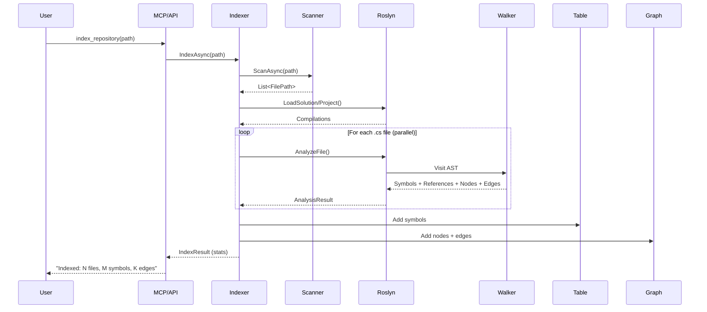
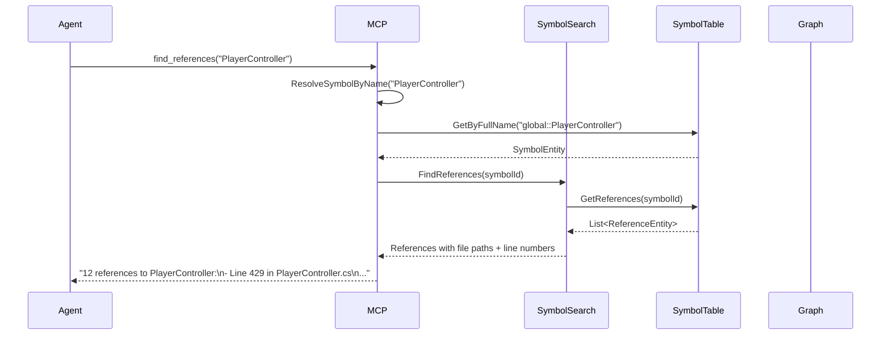
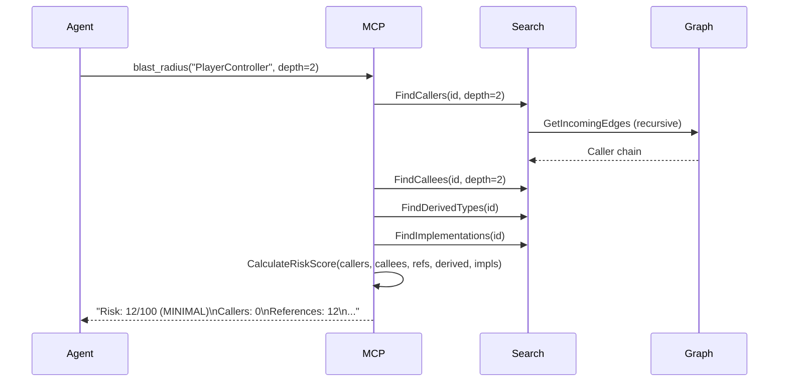

# NexusCode — Developer Guide

> A Roslyn-based Code Intelligence Platform for C# and Unity projects. Provides Knowledge Graph construction, Symbol Search, MCP integration for AI agents, and Graph RAG.

---

## 1. Project Overview

**Purpose:** Give AI agents (and developers) deep, semantic understanding of C# and Unity codebases — beyond text search, into symbol relationships, inheritance hierarchies, call graphs, and dependency chains.

**Business Domain:** Developer tooling / AI code intelligence.

**Target Users:**
- AI coding assistants connecting via MCP protocol
- Developers using the REST API or NexusGraph web UI
- Unity teams needing project structure analysis

**Main Features:**
- Roslyn-based semantic code analysis (not regex)
- Knowledge graph with 22 node kinds and 24 edge kinds
- 12 MCP tools for AI agent integration
- Symbol search with fuzzy matching and trigram indexing
- Graph RAG (retrieval-augmented generation) via Ollama
- Unity-specific analysis (MonoBehaviour, Prefabs, Scenes, Addressables)
- Multi-repository cross-repo search and comparison
- Blast radius / impact analysis with risk scoring
- In-memory vector store + optional Qdrant backend

---

## 2. High-Level Architecture

```
┌─────────────────────────────────────────────────────┐
│                   Clients                           │
│  ┌──────────┐  ┌──────────┐  ┌──────────────────┐  │
│  │ AI Agent │  │ REST API │  │ NexusGraph (UI)  │  │
│  │ (MCP)    │  │ Client   │  │ React+Sigma.js   │  │
│  └────┬─────┘  └────┬─────┘  └───────┬──────────┘  │
│       │ JSON-RPC     │ HTTP           │ HTTP         │
└───────┼──────────────┼───────────────┼──────────────┘
        │              │               │
┌───────▼──────────────▼───────────────▼──────────────┐
│              Application Layer                       │
│  ┌──────────────┐  ┌──────────────┐                  │
│  │ MCP Server   │  │ REST API     │                  │
│  │ (12 tools)   │  │ (5 ctrl)     │                  │
│  └──────┬───────┘  └──────┬───────┘                  │
│         │                  │                          │
│  ┌──────▼──────────────────▼───────┐                 │
│  │      NexusIndexService          │                 │
│  │  (orchestrator singleton)       │                 │
│  └──────┬───────┬──────────┬───────┘                 │
└─────────┼───────┼──────────┼─────────────────────────┘
          │       │          │
┌─────────▼───────▼──────────▼─────────────────────────┐
│              Core Engine (NexusCode.Roslyn)           │
│  ┌────────────────┐  ┌──────────────┐                 │
│  │ SymbolSearch   │  │ Knowledge    │                 │
│  │ Engine         │  │ Graph        │                 │
│  └───────┬────────┘  └──────┬───────┘                 │
│          │                   │                         │
│  ┌───────▼───────────────────▼───────┐               │
│  │         SymbolTable               │               │
│  │  (7 concurrent dictionaries)      │               │
│  └───────────────┬───────────────────┘               │
│                  │                                    │
│  ┌───────────────▼───────────────────┐               │
│  │      CodeIndexer Pipeline          │               │
│  │  FileScanner → RoslynEngine       │               │
│  │  → SyntaxWalker → Entities        │               │
│  └───────────────────────────────────┘               │
└──────────────────────────────────────────────────────┘
          │
┌─────────▼───────────────────────────────────────────┐
│              Persistence Layer                        │
│  ┌──────────┐  ┌──────────────┐  ┌───────────────┐  │
│  │ SQLite   │  │ InMemory     │  │ Ollama        │  │
│  │ (symbols,│  │ VectorStore  │  │ (embeddings)  │  │
│  │  graph)  │  │ (or Qdrant)  │  │               │  │
│  └──────────┘  └──────────────┘  └───────────────┘  │
└──────────────────────────────────────────────────────┘
```

---

## 3. Folder Structure

```
NexusCode/
├── src/
│   ├── NexusCode.Domain/          # Entities, enums, interfaces, color config
│   ├── NexusCode.Roslyn/          # Core engine: Roslyn, graph, search, Unity analyzers
│   ├── NexusCode.Indexer/         # CodeIndexer + CLI entry point
│   ├── NexusCode.Mcp/             # MCP server (JSON-RPC over stdio)
│   ├── NexusCode.Api/             # REST API (ASP.NET Core)
│   ├── NexusCode.Database/        # SQLite persistence
│   ├── NexusCode.Embedding/       # Ollama embedding client + incremental cache
│   ├── NexusCode.VectorStore/     # Vector storage abstraction + implementations
│   ├── NexusCode.Context/         # Graph RAG context builder
│   ├── NexusCode.Graph/           # (placeholder — future use)
│   ├── NexusCode.Symbols/         # (placeholder — future use)
│   └── NexusCode.Tests/           # xUnit unit + integration tests
├── NexusGraph/                    # React + Sigma.js frontend
├── docs/                          # Architecture, features, roadmap, ADRs
└── publish/                       # Pre-built MCP server and indexer binaries
```

### Module Responsibilities

| Layer | Project | Responsibility |
|-------|---------|----------------|
| **Domain** | `NexusCode.Domain` | Shared entities (SymbolEntity, GraphNodeEntity, etc.), enums (SymbolKind, EdgeKind), interfaces, ColorConfig |
| **Engine** | `NexusCode.Roslyn` | Roslyn parsing, symbol extraction, knowledge graph, search engine, multi-repo, Unity analyzers, metrics |
| **Indexing** | `NexusCode.Indexer` | File scanning, compilation building, parallel analysis pipeline |
| **Integration** | `NexusCode.Mcp` | AI agent integration via MCP JSON-RPC protocol (12 tools) |
| **API** | `NexusCode.Api` | REST endpoints, DI services, Swagger docs |
| **Storage** | `NexusCode.Database` | SQLite CRUD for symbols, graph, chunks |
| **AI** | `NexusCode.Embedding` | Ollama embeddings, incremental indexing, batch queue |
| **Vectors** | `NexusCode.VectorStore` | In-memory cosine similarity or Qdrant adapter |
| **RAG** | `NexusCode.Context` | Graph RAG context building |
| **Tests** | `NexusCode.Tests` | 64 unit + integration tests |

---

## 4. Request Lifecycle

### MCP Tool Request (AI Agent)

```
AI Agent
  │
  │ JSON-RPC over stdin
  ▼
MCP Server (Program.cs)
  │
  ├── Parse request, extract tool name + arguments
  │
  ├── Resolve symbol name (ResolveSymbolByName):
  │   1. Try exact FullName match
  │   2. Try global:: prefix match
  │   3. Try GetByName
  │   4. Fallback: case-insensitive type scan
  │
  ├── Route to handler (FindReferences, FindCallers, etc.)
  │   │
  │   ├── SymbolSearchEngine queries SymbolTable (symbol data)
  │   │                    + KnowledgeGraph (relationships)
  │   │
  │   └── Results formatted as text
  │
  ▼
JSON-RPC response over stdout → AI Agent
```

### REST API Request (Web UI / External Client)

```
Client (browser/curl)
  │
  │ HTTP
  ▼
ASP.NET Core Router
  │
  ▼
Controller (e.g., SearchController)
  │
  ├── Injects NexusIndexService (singleton)
  │
  ├── Delegates to service method
  │   │
  │   ├── SymbolSearchEngine.FindSymbol()
  │   ├── SymbolSearchEngine.FindCallers()
  │   └── etc.
  │
  ▼
JSON response → Client
```

---

## 5. Application Startup Lifecycle

### MCP Server Startup

1. Create `SymbolTable` (empty)
2. Create `KnowledgeGraph` (empty)
3. Create `SymbolSearchEngine` (builds trigram index from empty table)
4. Create session tracking dictionary
5. Enter stdin read loop (JSON-RPC)
6. On `index_repository` call: `CodeIndexer.IndexAsync()` → merge results into live tables

### REST API Startup

1. Register singletons: `IndexingService`, `PersistenceService`, `MultiRepoManagerService`, `NexusIndexService`
2. `NexusIndexService` constructor: attempt to restore from SQLite (if data exists)
3. Enable Swagger/OpenAPI
4. Enable CORS (allow all origins)
5. Map controllers + health endpoint

### CLI Indexer Startup

1. Parse repository path from command-line args
2. Create `CodeIndexer`
3. Run `IndexAsync()` with progress reporting
4. Print statistics (files, symbols, graph nodes/edges)

---

## 6. Core Modules

### SymbolTable

**Purpose:** In-memory multi-indexed symbol store with 7 concurrent dictionaries.

| Index | Lookup |
|-------|--------|
| `_symbolsById` | By GUID |
| `_symbolsByFullName` | By fully qualified name (e.g. `global::GameService`) |
| `_symbolsByName` | By short name (e.g. `GameService`) |
| `_symbolsByKind` | By SymbolKind (Type, Method, Property, Field, Event) |
| `_symbolsByFile` | By file path |
| `_symbolsByContainer` | By containing type GUID |
| `_references` | References by symbol GUID |

**Key method — `ResolveSymbol(name)`:** Cascading fallback: exact full name → exact name → case-insensitive → prefix → contains. Prioritizes Type > Method kinds.

### KnowledgeGraph

**Purpose:** In-memory directed graph with bidirectional adjacency lists.

- Nodes: `byte[]` IDs (SHA256 of full name)
- Edges: `byte[]` IDs (MD5 of source + target + kind)
- Supports 22 node kinds (Class, Method, MonoBehaviour, Prefab, etc.) and 24 edge kinds (Calls, Inherits, Implements, etc.)

### SyntaxWalker

**Purpose:** Roslyn AST visitor that extracts symbols, references, and graph structures from C# source.

Overrides: `VisitClassDeclaration`, `VisitMethodDeclaration`, `VisitPropertyDeclaration`, `VisitFieldDeclaration`, `VisitEventDeclaration`, `VisitInvocationExpression`, `VisitIdentifierName`, and more.

Outputs: `Symbols`, `References`, `GraphNodes`, `GraphEdges` lists consumed by the indexer.

### SymbolSearchEngine

**Purpose:** Multi-tier symbol search with graph traversal.

- **Search tiers:** Exact (1.0) → Name (0.9) → Prefix (0.7) → Trigram fuzzy (0.4)
- **Graph queries:** FindCallers, FindCallees (recursive BFS), FindDerivedTypes, FindImplementations, FindOverrides
- **Source search:** `SearchSourceText()` reads .cs files from disk for line-level text matching

### CodeIndexer

**Purpose:** Orchestrates the full indexing pipeline.

```
FileScanner (find .cs files)
  → RoslynEngine (load projects, build compilations)
    → Parallel.ForEachAsync (analyze each file)
      → SyntaxWalker (extract entities)
        → Merge into SymbolTable + KnowledgeGraph
```

### Unity Analyzers

6 specialized analyzers for Unity projects:
- `UnityAnalyzer` — MonoBehaviour/ScriptableObject detection, serialized fields, lifecycle methods
- `UnityEventAnalyzer` — UnityEvent connections
- `UnityPrefabAnalyzer` — .prefab YAML parsing
- `UnitySceneAnalyzer` — .unity scene file parsing
- `UnityAddressablesAnalyzer` — Addressable asset scanning
- `UnityIntelligenceEngine` — Orchestrator combining all analyzers

### Embedding Engine

- `OllamaClient` — HTTP client for Ollama local LLM API
- `EmbeddingEngine` — MD5-based in-memory cache + batch support
- `IncrementalEmbeddingEngine` — SQLite-backed content-hash dedup
- `BatchEmbeddingQueue` — Async producer-consumer batching (batchSize=32)

---

## 7. Business Flow

### Index a Repository



### Find References



### Blast Radius Analysis



---

## 8. Database

### SQLite Tables (`nexus.db`)

| Table | Columns | Purpose |
|-------|---------|---------|
| `symbols` | id, repository_id, name, full_name, kind, type_name, file_path, start_line, end_line, metadata | Persisted symbols |
| `graph_nodes` | id (BLOB), full_name, label, kind, metadata | Persisted graph nodes |
| `graph_edges` | id (BLOB), source_id, target_id, kind, weight | Persisted graph edges |
| `chunks` | id, repository_id, symbol_id, content, chunk_type, content_hash, token_count, embedding | RAG text chunks |

### Embedding Cache (`nexus_embeddings.db`)

| Table | Columns | Purpose |
|-------|---------|---------|
| `embedding_meta` | file_path, content_hash, last_modified, chunk_count, model | Change detection |
| `embeddings` | id, file_path, chunk_index, content_hash, model, created | Cached embeddings |

---

## 9. Authentication & Authorization

**None.** The REST API has CORS set to allow all origins. The MCP server communicates over stdio with no authentication. This is a local-first tool intended for developer machines, not public deployment.

---

## 10. API Design

### REST Endpoints (ASP.NET Core)

| Method | Route | Description |
|--------|-------|-------------|
| POST | `/api/index/repository` | Index a C# repository |
| GET | `/api/index/status` | Current indexing status |
| GET | `/api/search/symbol?query=` | Search symbols |
| GET | `/api/search/callers/{name}` | Find callers of a method |
| GET | `/api/search/callees/{name}` | Find callees of a method |
| GET | `/api/search/implementations/{name}` | Find interface implementations |
| GET | `/api/search/derived/{name}` | Find derived types |
| GET | `/api/graph/stats` | Graph statistics |
| GET | `/api/graph/nodes/{kind}` | Nodes by kind |
| GET | `/api/graph/edges/{kind}` | Edges by kind |
| GET | `/api/graph/export` | Full graph export with colors |
| GET | `/api/graph/mermaid` | Mermaid diagram |
| POST | `/api/multirepo/index` | Index multiple repos |
| GET | `/api/multirepo/list` | List indexed repos |
| GET | `/api/multirepo/search` | Cross-repo search |
| POST | `/api/rag/ask` | Graph RAG question |

### MCP Tools (JSON-RPC over stdio)

| Tool | Input | Output |
|------|-------|--------|
| `list_symbols` | kind, name | Symbol list with file:line |
| `find_symbol` | query | Matching symbols |
| `find_references` | symbolName | References with file paths |
| `find_callers` | method | Caller chain with depth |
| `find_callees` | method | Callee chain with depth |
| `find_implementations` | interfaceName | Implementing types |
| `find_derived_types` | typeName | Derived type hierarchy |
| `search_code` | query | Symbol matches + source text matches |
| `get_symbol_info` | symbolName | Full metadata (callers, callees, refs count) |
| `explain_architecture` | — | Stats: symbols, classes, methods, graph |
| `index_repository` | path | Indexing result |
| `blast_radius` | symbolName, depth | Impact analysis with risk score |

---

## 11. Event Flow

**No event/message queue system.** All operations are synchronous (MCP) or request-response (REST). The `BatchEmbeddingQueue` is the only async pipeline — a producer-consumer queue with background processing.

File watching is available via `RepositoryWatcher` but is not wired into active use.

---

## 12. Configuration

**No `appsettings.json`.** Configuration is code-based:

| Setting | Location | Default |
|---------|----------|---------|
| SQLite database | `SqliteRepository.cs` | `{BaseDirectory}/.nexus/nexus.db` |
| Embedding database | `IncrementalEmbeddingEngine.cs` | `nexus_embeddings.db` |
| Indexed repos config | `PersistenceService.cs` | `{BaseDirectory}/.nexus/indexed_repos.json` |
| Ollama endpoint | `OllamaClient.cs` | `http://localhost:11434` |
| Vector DB (Qdrant) | `QdrantAdapter.cs` | `http://localhost:6333` |
| MCP publish path | Config file | `D:\NexusCode\publish\NexusCode.Mcp.exe` |

---

## 13. Dependency Graph

```
Domain (root — no dependencies)
├── Roslyn ──┬── Indexer ──── Mcp (exe)
│            ├── Database ─── Api (web)
│            └── Context
├── Embedding
└── VectorStore

Tests → Domain, Roslyn, Indexer, Embedding, VectorStore
```

**Tightly coupled:** `NexusIndexService` ↔ `SymbolTable` + `KnowledgeGraph` + `SymbolSearchEngine`. These three must always be in sync.

---

## 14. Testing Strategy

### Unit Tests (50 tests)

| File | Tests | What |
|------|-------|------|
| `SymbolTableTests.cs` | 9 | CRUD, indexing, references |
| `SymbolTableResolveTests.cs` | 12 | Fuzzy resolution, FilePath regression |
| `SearchSourceTextTests.cs` | 11 | Source text search with temp files |
| `KnowledgeGraphTests.cs` | 6 | Graph operations, cascading delete |
| `InMemoryVectorStoreTests.cs` | 6 | Vector CRUD, cosine similarity |
| `MultiRepoTests.cs` | 5 | Cross-repo search, comparison, health |

### Integration Tests (14 tests)

| File | Tests | What |
|------|-------|------|
| `IndexerIntegrationTests.cs` | 5 | Full indexing pipeline |
| `SearchIntegrationTests.cs` | 4 | Cross-repo search end-to-end |
| `ApiIntegrationTests.cs` | 7 | Metrics, logging, LRU cache |

### Running Tests

```bash
dotnet test                          # All 64 tests
dotnet test --filter "SymbolTable"   # By class
dotnet test --filter "ResolveSymbol" # By name
```

---

## 15. Extension Guide

### Add a New MCP Tool

1. Add tool definition in `Program.cs` → `tools/list` response
2. Add handler function: `string HandleNewTool(JsonElement? args)`
3. Add routing in `tools/call` switch expression
4. Publish: `dotnet publish -c Release -o D:\NexusCode\publish`
5. User restarts AI assistant to load new exe

### Add a New REST Endpoint

1. Add method in appropriate controller under `src/NexusCode.Api/Controllers/`
2. Inject `NexusIndexService`
3. Delegate to `SearchEngine` or `SymbolTable`
4. Return `Ok(result)` or `BadRequest(error)`

### Add a New Graph Edge Kind

1. Add value to `EdgeKind` enum in `src/NexusCode.Domain/Enums.cs`
2. Add edge creation logic in `SyntaxWalker` or relevant analyzer
3. Add color in `ColorConfig.cs`
4. Update `HandleIndexRepository` in MCP (edges are copied via `Enum.GetValues<EdgeKind>()`)

### Add a New Symbol Kind

1. Add value to `SymbolKind` enum in `Enums.cs`
2. Add visitor in `SyntaxWalker` (e.g., `VisitDelegateDeclaration`)
3. Add to `BuildTrigramIndex()` in `SymbolSearchEngine`
4. Add to `list_symbols` filter in MCP handler

### Add a New Unity Analyzer

1. Create `UnityXxxAnalyzer.cs` in `src/NexusCode.Roslyn/`
2. Return `List<GraphNodeEntity>` + `List<GraphEdgeEntity>`
3. Wire into `UnityIntelligenceEngine.Analyze()`
4. Add test in `NexusCode.Tests/`

---

## 16. Common Pitfalls

| Pitfall | Explanation |
|---------|-------------|
| **MCP server is stateless** | In-memory SymbolTable/Graph. Call `index_repository` before querying. Restart loses all data. |
| **`dotnet build` ≠ `dotnet publish`** | Building outputs to `bin/`. MCP config references `publish/`. Must run `dotnet publish -c Release -o publish/`. |
| **Cannot publish while MCP is running** | Windows locks DLLs. Must kill the MCP process first: `Stop-Process -Name NexusCode.Mcp -Force` |
| **Short names may resolve to wrong symbol** | `PlayerController` could match a Property instead of the Type. Use `global::PlayerController` for precision. |
| **FindCallers on Type symbols returns 0** | Correct behavior — Calls edges are method-to-method. Types don't appear as callers. |
| **No FindDerivedTypes for external types** | MonoBehaviour is not in the indexed codebase, so `find_derived_types("MonoBehaviour")` returns "not found". |
| **SearchSourceText reads from disk** | Only works when source files are at the indexed paths. Broken paths → empty results. |
| **All MCP handlers are synchronous** | `Func<JsonElement?, string>`, not async. Long operations block the stdin read loop. |

---

## 17. Glossary

| Term | Definition |
|------|------------|
| **MCP** | Model Context Protocol — JSON-RPC 2.0 over stdio for AI agent integration |
| **SymbolTable** | In-memory store of all extracted symbols with 7 concurrent dictionary indexes |
| **KnowledgeGraph** | In-memory directed graph of code relationships (calls, inherits, implements, etc.) |
| **SyntaxWalker** | Roslyn AST visitor that extracts symbols, references, and graph structures |
| **Blast Radius** | Impact analysis: what breaks if a symbol is changed |
| **Graph RAG** | Retrieval-Augmented Generation combining knowledge graph traversal with vector search |
| **Trigram Index** | 3-character substring index for fuzzy symbol matching |
| **Deterministic GUID** | GUID generated from MD5 hash of a symbol's fully qualified name (consistent across runs) |
| **Risk Score** | 0-100 score based on caller/callee/reference/derived/implementation counts |
| **NodeKind** | 22-value enum for graph node types (Class, Method, MonoBehaviour, Prefab, etc.) |
| **EdgeKind** | 24-value enum for graph edge types (Calls, Inherits, Implements, UnityEvent, etc.) |
| **Unity Intelligence** | Specialized analysis for Unity projects (scenes, prefabs, addressables, serialized fields) |
| **Cross-Repo Search** | Searching across multiple indexed repositories with result deduplication |
| **Incremental Indexing** | Change detection via SHA256 content hashes — only re-index modified files |
| **ContextBuilder** | Assembles graph context for RAG queries |
| **NexusIndexService** | Central orchestrator singleton managing SymbolTable, KnowledgeGraph, and SearchEngine |
