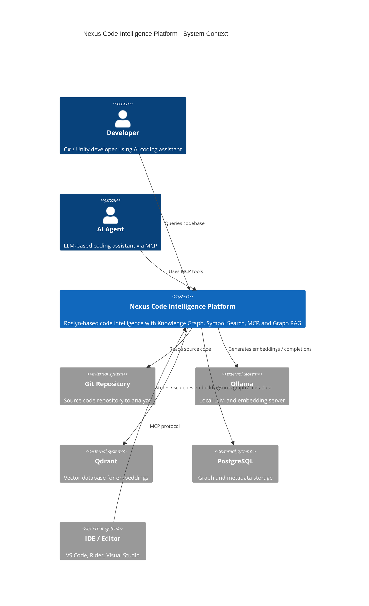
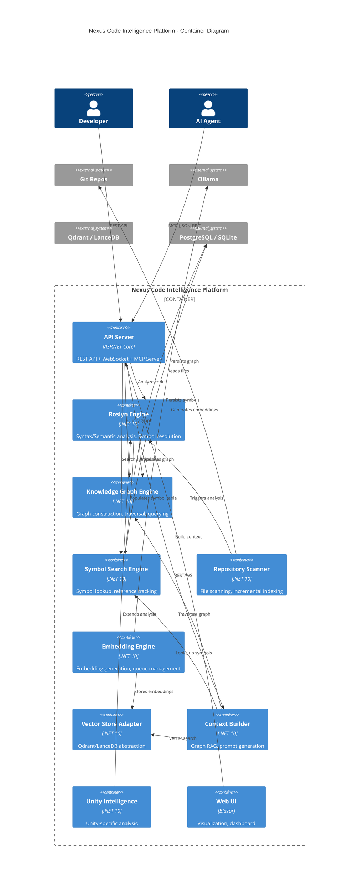
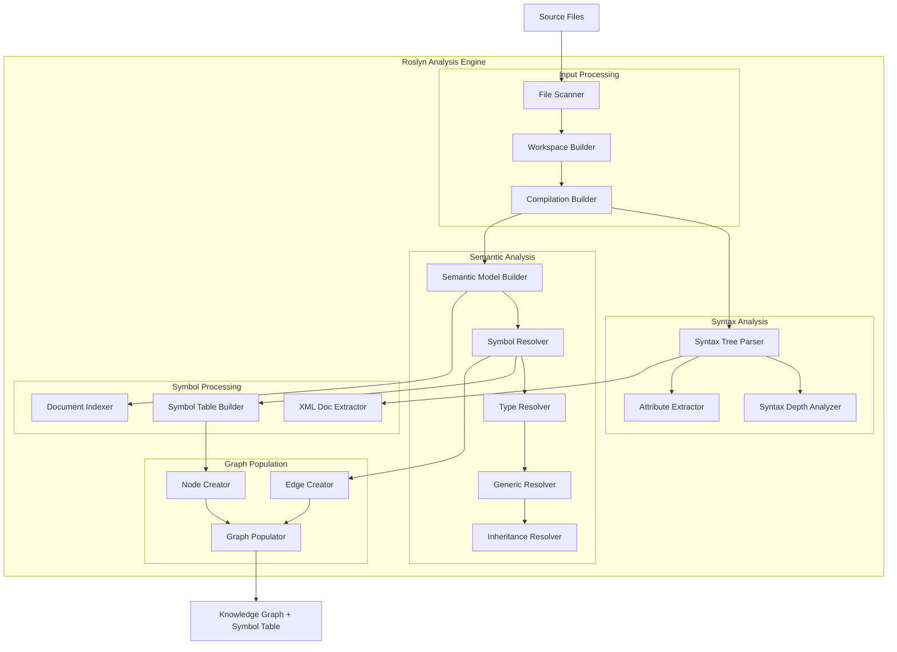
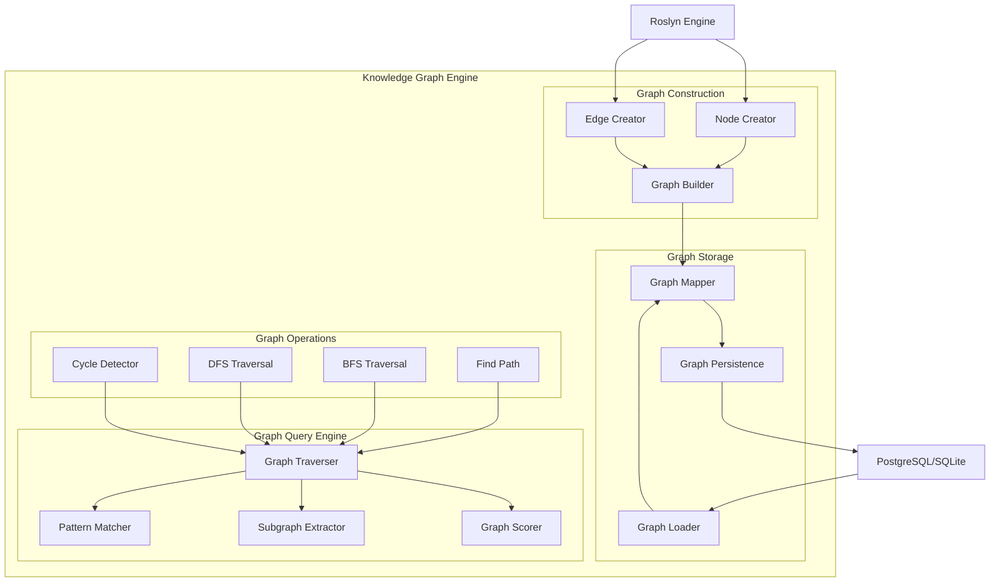
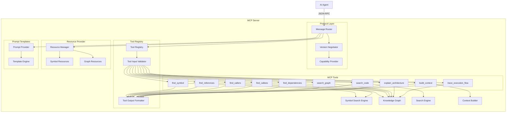
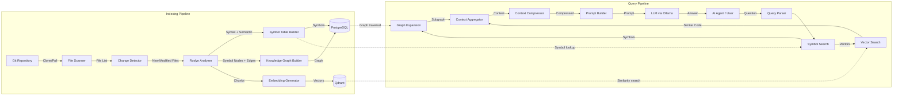
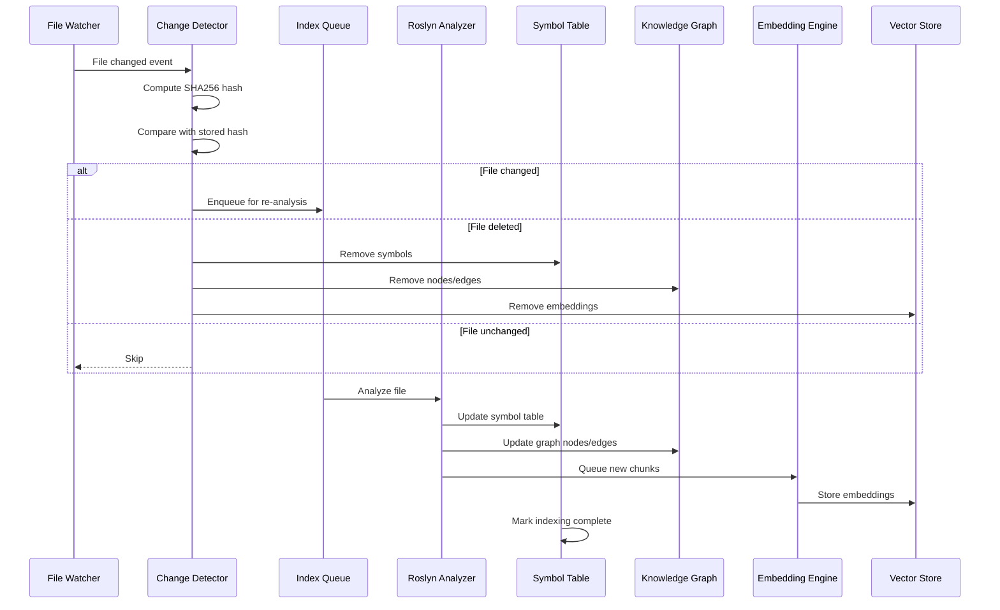
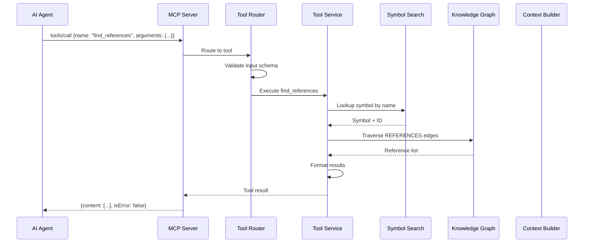
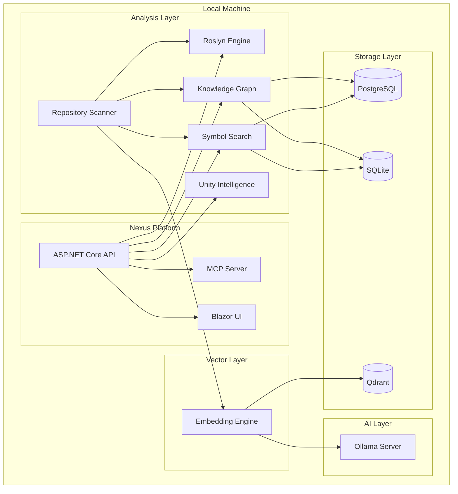
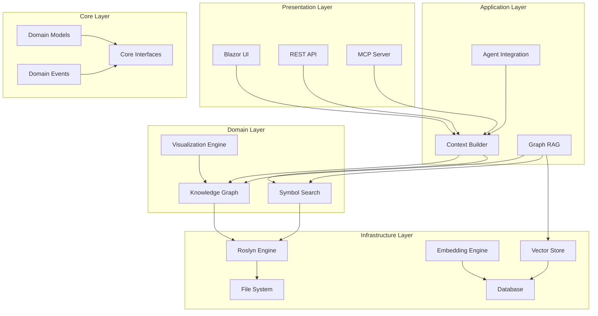

# Nexus Code Intelligence Platform - Architecture Diagrams

## 1. Context Diagram

## 2. Container Diagram

## 3. Component Diagram - Roslyn Analysis Engine

## 4. Component Diagram - Knowledge Graph Engine

## 5. Component Diagram - MCP Server

## 6. Data Flow Diagram - Complete Pipeline

## 7. Data Flow Diagram - Incremental Indexing

## 8. Data Flow Diagram - MCP Tool Execution

## 9. Deployment Architecture

## 10. Layered Architecture

