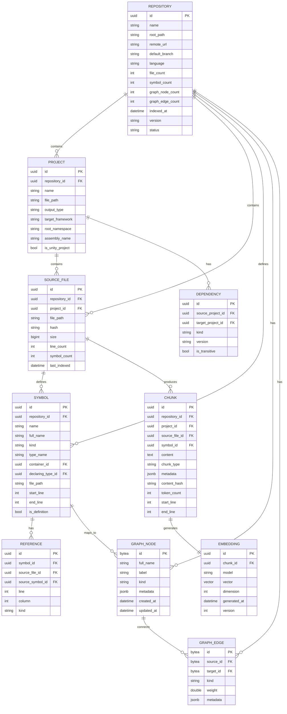

# Nexus Code Intelligence Platform - Agent Integration, Database, Visualization

---

## 1. Agent Integration Layer

### 1.1 Adapter Pattern

```
┌─────────────────────────────────────────────────────────┐
│              Agent Integration Layer                     │
├─────────────────────────────────────────────────────────┤
│                                                          │
│  ┌──────────────┐  ┌──────────────┐  ┌──────────────┐  │
│  │   IAgent     │  │   Ollama     │  │   OpenAI     │  │
│  │   Adapter    │← │   Adapter    │  │   Adapter    │  │
│  └──────────────┘  └──────────────┘  └──────────────┘  │
│         ↑                  ↑                  ↑          │
│  ┌──────────────┐  ┌──────────────┐  ┌──────────────┐  │
│  │   Claude     │  │   Gemini     │  │   OpenRouter  │  │
│  │   Adapter    │  │   Adapter    │  │   Adapter    │  │
│  └──────────────┘  └──────────────┘  └──────────────┘  │
│                                                          │
└─────────────────────────────────────────────────────────┘
```

### 1.2 Adapter Interface

```csharp
interface IAgentAdapter
{
    string Name { get; }
    bool IsAvailable { get; }
    
    Task<AgentResponse> Complete(
        string prompt,
        AgentOptions options);
    
    Task<List<string>> Embed(
        string[] inputs,
        string model);
    
    Task<AgentHealth> HealthCheck();
}

class AgentOptions
{
    string Model { get; set; }
    int MaxTokens { get; set; } = 4096;
    double Temperature { get; set; } = 0.7;
    bool Stream { get; set; } = false;
    CancellationToken CancellationToken { get; set; }
}

class AgentResponse
{
    string Content;
    int TokensUsed;
    TimeSpan Duration;
    string Model;
    bool IsSuccess;
    string? Error;
}

class AgentHealth
{
    bool IsHealthy;
    string Status;
    Dictionary<string, object> Metadata;
}
```

### 1.3 Ollama Adapter

```csharp
class OllamaAdapter : IAgentAdapter
{
    private readonly HttpClient _httpClient;
    private readonly string _baseUrl;
    
    public string Name => "Ollama";
    
    public bool IsAvailable => CheckAvailability().Result;
    
    public async Task<AgentResponse> Complete(string prompt, AgentOptions options)
    {
        var request = new
        {
            model = options.Model,
            messages = new[]
            {
                new { role = "user", content = prompt }
            },
            stream = false,
            options = new
            {
                num_predict = options.MaxTokens,
                temperature = options.Temperature
            }
        };
        
        var response = await _httpClient.PostAsJsonAsync($"{_baseUrl}/api/chat", request);
        response.EnsureSuccessStatusCode();
        
        var result = await response.Content.ReadFromJsonAsync<OllamaChatResponse>();
        
        return new AgentResponse
        {
            Content = result.Message.Content,
            TokensUsed = result.EvalCount,
            Duration = TimeSpan.FromMilliseconds(result.TotalDuration / 1_000_000),
            Model = options.Model,
            IsSuccess = true
        };
    }
    
    public async Task<List<string>> Embed(string[] inputs, string model)
    {
        var request = new
        {
            model = model,
            input = inputs
        };
        
        var response = await _httpClient.PostAsJsonAsync($"{_baseUrl}/api/embed", request);
        response.EnsureSuccessStatusCode();
        
        var result = await response.Content.ReadFromJsonAsync<OllamaEmbedResponse>();
        
        return result.Embeddings.Select(e => JsonSerializer.Serialize(e)).ToList();
    }
    
    public async Task<AgentHealth> HealthCheck()
    {
        try
        {
            var response = await _httpClient.GetAsync($"{_baseUrl}/api/tags");
            return new AgentHealth
            {
                IsHealthy = response.IsSuccessStatusCode,
                Status = "Connected"
            };
        }
        catch
        {
            return new AgentHealth
            {
                IsHealthy = false,
                Status = "Disconnected"
            };
        }
    }
}
```

### 1.4 OpenAI Adapter

```csharp
class OpenAIAdapter : IAgentAdapter
{
    private readonly HttpClient _httpClient;
    private readonly string _apiKey;
    
    public string Name => "OpenAI";
    
    public bool IsAvailable => !string.IsNullOrEmpty(_apiKey);
    
    public async Task<AgentResponse> Complete(string prompt, AgentOptions options)
    {
        var request = new
        {
            model = options.Model ?? "gpt-4",
            messages = new[]
            {
                new { role = "user", content = prompt }
            },
            max_tokens = options.MaxTokens,
            temperature = options.Temperature
        };
        
        var httpRequest = new HttpRequestMessage(HttpMethod.Post, "https://api.openai.com/v1/chat/completions")
        {
            Content = JsonContent.Create(request)
        };
        httpRequest.Headers.Add("Authorization", $"Bearer {_apiKey}");
        
        var response = await _httpClient.SendAsync(httpRequest);
        response.EnsureSuccessStatusCode();
        
        var result = await response.Content.ReadFromJsonAsync<OpenAIResponse>();
        
        return new AgentResponse
        {
            Content = result.Choices[0].Message.Content,
            TokensUsed = result.Usage.TotalTokens,
            Model = options.Model ?? "gpt-4",
            IsSuccess = true
        };
    }
    
    public async Task<List<string>> Embed(string[] inputs, string model)
    {
        var request = new
        {
            model = model ?? "text-embedding-3-small",
            input = inputs
        };
        
        var httpRequest = new HttpRequestMessage(HttpMethod.Post, "https://api.openai.com/v1/embeddings")
        {
            Content = JsonContent.Create(request)
        };
        httpRequest.Headers.Add("Authorization", $"Bearer {_apiKey}");
        
        var response = await _httpClient.SendAsync(httpRequest);
        response.EnsureSuccessStatusCode();
        
        var result = await response.Content.ReadFromJsonAsync<OpenAIEmbedResponse>();
        
        return result.Data.Select(d => JsonSerializer.Serialize(d.Embedding)).ToList();
    }
}
```

### 1.5 Agent Registry

```csharp
class AgentRegistry
{
    private readonly Dictionary<string, IAgentAdapter> _adapters;
    
    public AgentRegistry()
    {
        _adapters = new Dictionary<string, IAgentAdapter>();
    }
    
    public void Register(IAgentAdapter adapter)
    {
        _adapters[adapter.Name] = adapter;
    }
    
    public IAgentAdapter? GetAdapter(string name)
    {
        return _adapters.TryGetValue(name, out var adapter) ? adapter : null;
    }
    
    public List<IAgentAdapter> GetAllAdapters()
    {
        return _adapters.Values.ToList();
    }
    
    public IAgentAdapter GetPrimaryAdapter()
    {
        // Return Ollama if available, otherwise first available
        var ollama = _adapters.Values.FirstOrDefault(a => a.Name == "Ollama" && a.IsAvailable);
        if (ollama != null) return ollama;
        
        return _adapters.Values.FirstOrDefault(a => a.IsAvailable) 
            ?? throw new InvalidOperationException("No available agent adapter");
    }
}
```

---

## 2. Database Schema

### 2.1 ERD (Entity Relationship Diagram)



### 2.2 SQL Tables (PostgreSQL)

```sql
-- Enable required extensions
CREATE EXTENSION IF NOT EXISTS "uuid-ossp";
CREATE EXTENSION IF NOT EXISTS "pg_trgm";

-- Repository table
CREATE TABLE repositories (
    id UUID PRIMARY KEY DEFAULT uuid_generate_v4(),
    name VARCHAR(255) NOT NULL,
    root_path TEXT NOT NULL,
    remote_url TEXT,
    default_branch VARCHAR(255) DEFAULT 'main',
    language VARCHAR(50) DEFAULT 'csharp',
    file_count INTEGER DEFAULT 0,
    symbol_count INTEGER DEFAULT 0,
    graph_node_count INTEGER DEFAULT 0,
    graph_edge_count INTEGER DEFAULT 0,
    indexed_at TIMESTAMPTZ,
    version VARCHAR(40),
    status VARCHAR(50) DEFAULT 'pending',
    created_at TIMESTAMPTZ DEFAULT NOW(),
    updated_at TIMESTAMPTZ DEFAULT NOW()
);

CREATE INDEX idx_repositories_name ON repositories(name);
CREATE INDEX idx_repositories_status ON repositories(status);

-- Project table
CREATE TABLE projects (
    id UUID PRIMARY KEY DEFAULT uuid_generate_v4(),
    repository_id UUID NOT NULL REFERENCES repositories(id) ON DELETE CASCADE,
    name VARCHAR(255) NOT NULL,
    file_path TEXT NOT NULL,
    output_type VARCHAR(50) DEFAULT 'Library',
    target_framework VARCHAR(100),
    root_namespace VARCHAR(255),
    assembly_name VARCHAR(255),
    is_unity_project BOOLEAN DEFAULT FALSE,
    created_at TIMESTAMPTZ DEFAULT NOW(),
    updated_at TIMESTAMPTZ DEFAULT NOW()
);

CREATE INDEX idx_projects_repository ON projects(repository_id);

-- Source files table
CREATE TABLE source_files (
    id UUID PRIMARY KEY DEFAULT uuid_generate_v4(),
    repository_id UUID NOT NULL REFERENCES repositories(id) ON DELETE CASCADE,
    project_id UUID NOT NULL REFERENCES projects(id) ON DELETE CASCADE,
    file_path TEXT NOT NULL,
    hash VARCHAR(64) NOT NULL,
    size BIGINT DEFAULT 0,
    line_count INTEGER DEFAULT 0,
    symbol_count INTEGER DEFAULT 0,
    last_indexed TIMESTAMPTZ,
    created_at TIMESTAMPTZ DEFAULT NOW(),
    updated_at TIMESTAMPTZ DEFAULT NOW(),
    
    UNIQUE(repository_id, file_path)
);

CREATE INDEX idx_source_files_repository ON source_files(repository_id);
CREATE INDEX idx_source_files_project ON source_files(project_id);
CREATE INDEX idx_source_files_hash ON source_files(hash);

-- Symbol table
CREATE TABLE symbols (
    id UUID PRIMARY KEY DEFAULT uuid_generate_v4(),
    repository_id UUID NOT NULL REFERENCES repositories(id) ON DELETE CASCADE,
    name VARCHAR(255) NOT NULL,
    full_name TEXT NOT NULL,
    kind VARCHAR(50) NOT NULL,
    type_name VARCHAR(255),
    container_id UUID REFERENCES symbols(id),
    declaring_type_id UUID REFERENCES symbols(id),
    file_path TEXT,
    start_line INTEGER,
    end_line INTEGER,
    is_definition BOOLEAN DEFAULT TRUE,
    metadata JSONB DEFAULT '{}',
    created_at TIMESTAMPTZ DEFAULT NOW(),
    updated_at TIMESTAMPTZ DEFAULT NOW()
);

CREATE INDEX idx_symbols_repository ON symbols(repository_id);
CREATE INDEX idx_symbols_name ON symbols(name);
CREATE INDEX idx_symbols_full_name ON symbols USING gin(full_name gin_trgm_ops);
CREATE INDEX idx_symbols_kind ON symbols(kind);
CREATE INDEX idx_symbols_container ON symbols(container_id);
CREATE INDEX idx_symbols_declaring_type ON symbols(declaring_type_id);

-- Reference table
CREATE TABLE references (
    id UUID PRIMARY KEY DEFAULT uuid_generate_v4(),
    symbol_id UUID NOT NULL REFERENCES symbols(id) ON DELETE CASCADE,
    source_file_id UUID NOT NULL REFERENCES source_files(id) ON DELETE CASCADE,
    source_symbol_id UUID REFERENCES symbols(id),
    line INTEGER NOT NULL,
    column INTEGER DEFAULT 0,
    kind VARCHAR(50) DEFAULT 'read',
    context TEXT,
    created_at TIMESTAMPTZ DEFAULT NOW()
);

CREATE INDEX idx_references_symbol ON references(symbol_id);
CREATE INDEX idx_references_source_file ON references(source_file_id);
CREATE INDEX idx_references_source_symbol ON references(source_symbol_id);

-- Dependency table
CREATE TABLE dependencies (
    id UUID PRIMARY KEY DEFAULT uuid_generate_v4(),
    source_project_id UUID NOT NULL REFERENCES projects(id) ON DELETE CASCADE,
    target_project_id UUID NOT NULL REFERENCES projects(id) ON DELETE CASCADE,
    kind VARCHAR(50) NOT NULL,
    version VARCHAR(100),
    is_transitive BOOLEAN DEFAULT FALSE,
    created_at TIMESTAMPTZ DEFAULT NOW(),
    
    UNIQUE(source_project_id, target_project_id, kind)
);

CREATE INDEX idx_dependencies_source ON dependencies(source_project_id);
CREATE INDEX idx_dependencies_target ON dependencies(target_project_id);

-- Chunk table
CREATE TABLE chunks (
    id UUID PRIMARY KEY DEFAULT uuid_generate_v4(),
    repository_id UUID NOT NULL REFERENCES repositories(id) ON DELETE CASCADE,
    project_id UUID NOT NULL REFERENCES projects(id) ON DELETE CASCADE,
    source_file_id UUID NOT NULL REFERENCES source_files(id) ON DELETE CASCADE,
    symbol_id UUID REFERENCES symbols(id),
    content TEXT NOT NULL,
    chunk_type VARCHAR(50) NOT NULL,
    metadata JSONB DEFAULT '{}',
    content_hash VARCHAR(64) NOT NULL,
    token_count INTEGER DEFAULT 0,
    start_line INTEGER,
    end_line INTEGER,
    embedding_id UUID,
    created_at TIMESTAMPTZ DEFAULT NOW(),
    updated_at TIMESTAMPTZ DEFAULT NOW()
);

CREATE INDEX idx_chunks_repository ON chunks(repository_id);
CREATE INDEX idx_chunks_project ON chunks(project_id);
CREATE INDEX idx_chunks_source_file ON chunks(source_file_id);
CREATE INDEX idx_chunks_symbol ON chunks(symbol_id);
CREATE INDEX idx_chunks_content_hash ON chunks(content_hash);

-- Graph nodes table
CREATE TABLE graph_nodes (
    id BYTEA PRIMARY KEY,
    full_name TEXT NOT NULL,
    label TEXT NOT NULL,
    kind VARCHAR(50) NOT NULL,
    metadata JSONB DEFAULT '{}',
    created_at TIMESTAMPTZ DEFAULT NOW(),
    updated_at TIMESTAMPTZ DEFAULT NOW()
);

CREATE INDEX idx_graph_nodes_kind ON graph_nodes(kind);
CREATE INDEX idx_graph_nodes_name ON graph_nodes USING gin(full_name gin_trgm_ops);

-- Graph edges table
CREATE TABLE graph_edges (
    id BYTEA PRIMARY KEY,
    source_id BYTEA NOT NULL REFERENCES graph_nodes(id) ON DELETE CASCADE,
    target_id BYTEA NOT NULL REFERENCES graph_nodes(id) ON DELETE CASCADE,
    kind VARCHAR(50) NOT NULL,
    weight DOUBLE PRECISION DEFAULT 1.0,
    metadata JSONB DEFAULT '{}',
    created_at TIMESTAMPTZ DEFAULT NOW(),
    
    UNIQUE(source_id, target_id, kind)
);

CREATE INDEX idx_graph_edges_source ON graph_edges(source_id);
CREATE INDEX idx_graph_edges_target ON graph_edges(target_id);
CREATE INDEX idx_graph_edges_kind ON graph_edges(kind);

-- Materialized view for fast traversal
CREATE MATERIALIZED VIEW graph_adjacency AS
SELECT 
    source_id,
    target_id,
    kind,
    array_agg(DISTINCT kind) OVER (PARTITION BY source_id) as edge_types
FROM graph_edges;

CREATE INDEX idx_adjacency_source ON graph_adjacency(source_id);
```

### 2.3 SQLite Schema (Alternative)

```sql
-- SQLite version for local-first mode

CREATE TABLE repositories (
    id TEXT PRIMARY KEY,
    name TEXT NOT NULL,
    root_path TEXT NOT NULL,
    remote_url TEXT,
    default_branch TEXT DEFAULT 'main',
    language TEXT DEFAULT 'csharp',
    file_count INTEGER DEFAULT 0,
    symbol_count INTEGER DEFAULT 0,
    indexed_at TEXT,
    version TEXT,
    status TEXT DEFAULT 'pending',
    created_at TEXT DEFAULT (datetime('now')),
    updated_at TEXT DEFAULT (datetime('now'))
);

CREATE TABLE projects (
    id TEXT PRIMARY KEY,
    repository_id TEXT NOT NULL REFERENCES repositories(id) ON DELETE CASCADE,
    name TEXT NOT NULL,
    file_path TEXT NOT NULL,
    output_type TEXT DEFAULT 'Library',
    target_framework TEXT,
    root_namespace TEXT,
    assembly_name TEXT,
    is_unity_project INTEGER DEFAULT 0,
    created_at TEXT DEFAULT (datetime('now')),
    updated_at TEXT DEFAULT (datetime('now'))
);

CREATE TABLE source_files (
    id TEXT PRIMARY KEY,
    repository_id TEXT NOT NULL REFERENCES repositories(id) ON DELETE CASCADE,
    project_id TEXT NOT NULL REFERENCES projects(id) ON DELETE CASCADE,
    file_path TEXT NOT NULL,
    hash TEXT NOT NULL,
    size INTEGER DEFAULT 0,
    line_count INTEGER DEFAULT 0,
    symbol_count INTEGER DEFAULT 0,
    last_indexed TEXT,
    UNIQUE(repository_id, file_path)
);

CREATE TABLE symbols (
    id TEXT PRIMARY KEY,
    repository_id TEXT NOT NULL REFERENCES repositories(id) ON DELETE CASCADE,
    name TEXT NOT NULL,
    full_name TEXT NOT NULL,
    kind TEXT NOT NULL,
    type_name TEXT,
    container_id TEXT REFERENCES symbols(id),
    declaring_type_id TEXT REFERENCES symbols(id),
    file_path TEXT,
    start_line INTEGER,
    end_line INTEGER,
    is_definition INTEGER DEFAULT 1,
    metadata TEXT DEFAULT '{}',
    UNIQUE(repository_id, full_name)
);

CREATE TABLE graph_nodes (
    id BLOB PRIMARY KEY,
    full_name TEXT NOT NULL,
    label TEXT NOT NULL,
    kind TEXT NOT NULL,
    metadata TEXT DEFAULT '{}',
    UNIQUE(full_name)
);

CREATE TABLE graph_edges (
    id BLOB PRIMARY KEY,
    source_id BLOB NOT NULL REFERENCES graph_nodes(id) ON DELETE CASCADE,
    target_id BLOB NOT NULL REFERENCES graph_nodes(id) ON DELETE CASCADE,
    kind TEXT NOT NULL,
    weight REAL DEFAULT 1.0,
    metadata TEXT DEFAULT '{}',
    UNIQUE(source_id, target_id, kind)
);
```

---

## 3. Visualization Layer

### 3.1 Supported Visualizations

| Visualization | Description | Use Case |
|---------------|-------------|----------|
| Call Graph | Method call relationships | Understanding execution flow |
| Dependency Graph | Project/package dependencies | Architecture analysis |
| Namespace Graph | Namespace relationships | Code organization |
| Type Hierarchy | Inheritance/implementations | OOP structure |
| Unity Graph | Component relationships | Unity-specific |
| Architecture Graph | High-level architecture | System overview |

### 3.2 Mermaid Generation

```
class MermaidGenerator
{
    GenerateCallGraph(methodId: string, depth: int):
        sb = new StringBuilder()
        sb.AppendLine("graph TD")
        
        // Get method node
        method = knowledgeGraph.GetNode(methodId)
        sb.AppendLine($"    {methodId}[\"{method.Label}\"]")
        
        // Get callees
        callees = knowledgeGraph.GetOutgoingEdges(methodId)
            .Where(e => e.Kind == EdgeKind.CALLS)
        
        foreach callee in callees:
            targetNode = knowledgeGraph.GetNode(callee.TargetId)
            sb.AppendLine($"    {callee.TargetId}[\"{targetNode.Label}\"]")
            sb.AppendLine($"    {methodId} --> {callee.TargetId}")
        
        // Recursive for deeper levels
        if depth > 1:
            foreach callee in callees:
                subGraph = GenerateCallGraph(callee.TargetId, depth - 1)
                sb.AppendLine(subGraph)
        
        return sb.ToString()
    
    GenerateDependencyGraph(projectId: string):
        sb = new StringBuilder()
        sb.AppendLine("graph LR")
        
        project = knowledgeGraph.GetNode(projectId)
        sb.AppendLine($"    {projectId}[\"{project.Label}\"]")
        
        dependencies = knowledgeGraph.GetOutgoingEdges(projectId)
            .Where(e => e.Kind == EdgeKind.DEPENDS_ON)
        
        foreach dep in dependencies:
            targetNode = knowledgeGraph.GetNode(dep.TargetId)
            sb.AppendLine($"    {dep.TargetId}[\"{targetNode.Label}\"]")
            sb.AppendLine($"    {projectId} --> {dep.TargetId}")
        
        return sb.ToString()
    
    GenerateTypeHierarchy(typeId: string):
        sb = new StringBuilder()
        sb.AppendLine("graph TD")
        
        type = knowledgeGraph.GetNode(typeId)
        sb.AppendLine($"    {typeId}[\"{type.Label}\"]")
        
        // Base types
        baseEdges = knowledgeGraph.GetOutgoingEdges(typeId)
            .Where(e => e.Kind == EdgeKind.INHERITS)
        
        foreach baseEdge in baseEdges:
            baseNode = knowledgeGraph.GetNode(baseEdge.TargetId)
            sb.AppendLine($"    {baseEdge.TargetId}[\"{baseNode.Label}\"]")
            sb.AppendLine($"    {typeId} -->|inherits| {baseEdge.TargetId}")
        
        // Implemented interfaces
        implEdges = knowledgeGraph.GetOutgoingEdges(typeId)
            .Where(e => e.Kind == EdgeKind.IMPLEMENTS)
        
        foreach implEdge in implEdges:
            implNode = knowledgeGraph.GetNode(implEdge.TargetId)
            sb.AppendLine($"    {implEdge.TargetId}[\"{implNode.Label}\"]:::interface")
            sb.AppendLine($"    {typeId} -.->|implements| {implEdge.TargetId}")
        
        // Derived types
        derivedEdges = knowledgeGraph.GetIncomingEdges(typeId)
            .Where(e => e.Kind == EdgeKind.INHERITS)
        
        foreach derivedEdge in derivedEdges:
            derivedNode = knowledgeGraph.GetNode(derivedEdge.SourceId)
            sb.AppendLine($"    {derivedEdge.SourceId}[\"{derivedNode.Label}\"]")
            sb.AppendLine($"    {derivedEdge.SourceId} -->|inherits| {typeId}")
        
        sb.AppendLine()
        sb.AppendLine("    classDef interface fill:#e1f5fe")
        
        return sb.ToString()
    
    GenerateUnityGraph(componentId: string):
        sb = new StringBuilder()
        sb.AppendLine("graph TD")
        
        component = knowledgeGraph.GetNode(componentId)
        sb.AppendLine($"    {componentId}[\"{component.Label}\"]:::monoBehaviour")
        
        // Required components
        requiredEdges = knowledgeGraph.GetOutgoingEdges(componentId)
            .Where(e => e.Kind == EdgeKind.REQUIRES)
        
        foreach reqEdge in requiredEdges:
            reqNode = knowledgeGraph.GetNode(reqEdge.TargetId)
            sb.AppendLine($"    {reqEdge.TargetId}[\"{reqNode.Label}\"]")
            sb.AppendLine($"    {componentId} -->|requires| {reqEdge.TargetId}")
        
        // References
        refEdges = knowledgeGraph.GetOutgoingEdges(componentId)
            .Where(e => e.Kind == EdgeKind.REFERENCES)
        
        foreach refEdge in refEdges:
            refNode = knowledgeGraph.GetNode(refEdge.TargetId)
            sb.AppendLine($"    {refEdge.TargetId}[\"{refNode.Label}\"]")
            sb.AppendLine($"    {componentId} -.->|references| {refEdge.TargetId}")
        
        sb.AppendLine()
        sb.AppendLine("    classDef monoBehaviour fill:#c8e6c9")
        
        return sb.ToString()
    
    GenerateArchitectureGraph(repositoryId: string):
        sb = new StringBuilder()
        sb.AppendLine("graph TB")
        
        // Get all projects
        projects = knowledgeGraph.GetNodesByKind(NodeKind.Project)
            .Where(n => n.RepositoryId == repositoryId)
        
        foreach project in projects:
            sb.AppendLine($"    {project.Id}[\"{project.Label}\"]")
        
        // Get all dependencies
        foreach project in projects:
            deps = knowledgeGraph.GetOutgoingEdges(project.Id)
                .Where(e => e.Kind == EdgeKind.DEPENDS_ON)
            
            foreach dep in deps:
                sb.AppendLine($"    {project.Id} --> {dep.TargetId}")
        
        return sb.ToString()
    }
}
```

### 3.3 Interactive Graph (Blazor Component)

```
// Razor component for interactive graph visualization
// Uses a JavaScript graph library (e.g., D3.js, vis.js, Cytoscape.js)

@page "/graph/{nodeId}"

<h3>Knowledge Graph</h3>

<div id="graph-container" style="width: 100%; height: 600px;">
    <!-- Graph rendered by JavaScript -->
</div>

<div class="graph-controls">
    <select @bind="graphType">
        <option value="call">Call Graph</option>
        <option value="dependency">Dependency Graph</option>
        <option value="hierarchy">Type Hierarchy</option>
        <option value="architecture">Architecture</option>
    </select>
    
    <select @bind="depth">
        <option value="1">Depth 1</option>
        <option value="2">Depth 2</option>
        <option value="3">Depth 3</option>
    </select>
    
    <button @onclick="RefreshGraph">Refresh</button>
    <button @onclick="ExportMermaid">Export Mermaid</button>
</div>

@code {
    [Parameter]
    public string NodeId { get; set; }
    
    string graphType = "call";
    int depth = 2;
    
    async Task RefreshGraph()
    {
        var graphData = await GraphService.GetGraphData(NodeId, graphType, depth);
        await JSRuntime.InvokeVoidAsync("renderGraph", graphData);
    }
    
    async Task ExportMermaid()
    {
        var mermaid = await GraphService.GenerateMermaid(NodeId, graphType, depth);
        await JSRuntime.InvokeVoidAsync("copyToClipboard", mermaid);
    }
}
```

### 3.4 Graph Data Format

```json
{
  "nodes": [
    {
      "id": "symbol-123",
      "label": "PlayerController",
      "kind": "Class",
      "metadata": {
        "filePath": "Assets/Scripts/Player/PlayerController.cs",
        "lineCount": 250
      },
      "group": "domain"
    }
  ],
  "edges": [
    {
      "from": "symbol-123",
      "to": "symbol-456",
      "kind": "CALLS",
      "label": "calls",
      "metadata": {
        "callCount": 15
      }
    }
  ],
  "metadata": {
    "totalNodes": 150,
    "totalEdges": 300,
    "generatedAt": "2024-01-15T10:30:00Z"
  }
}
```
